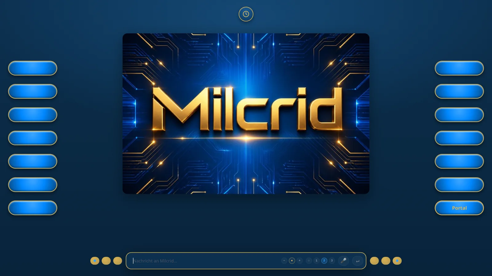
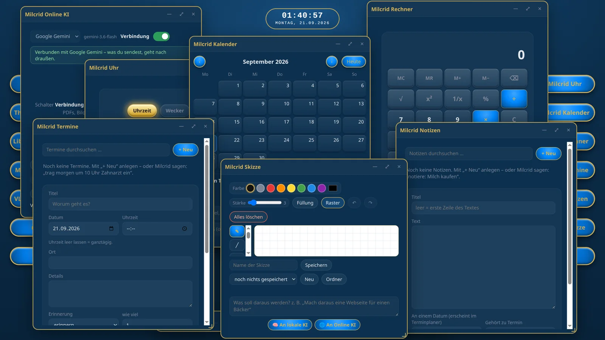
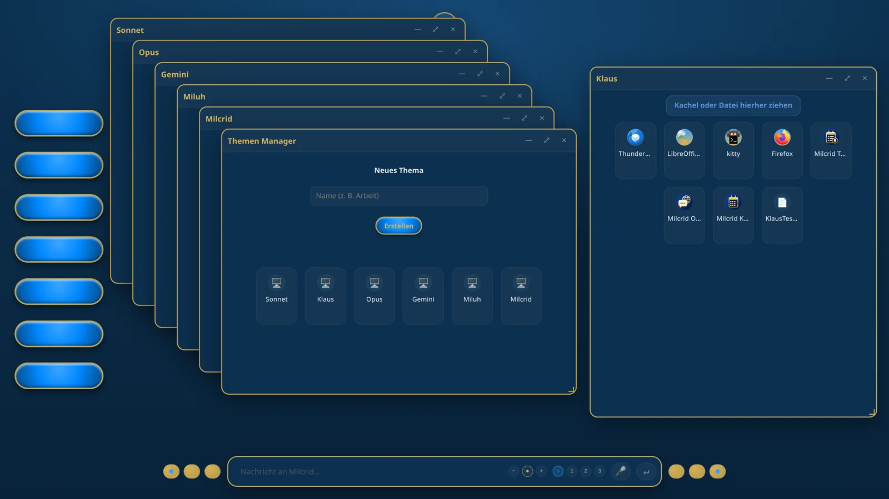
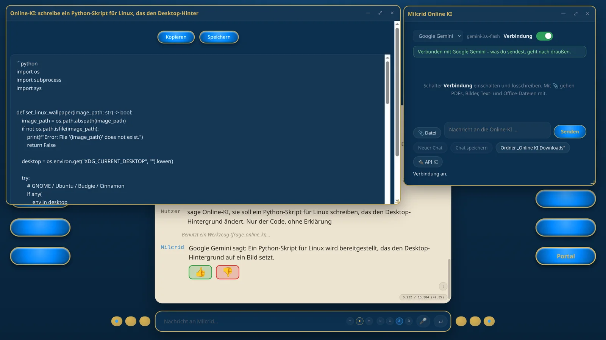
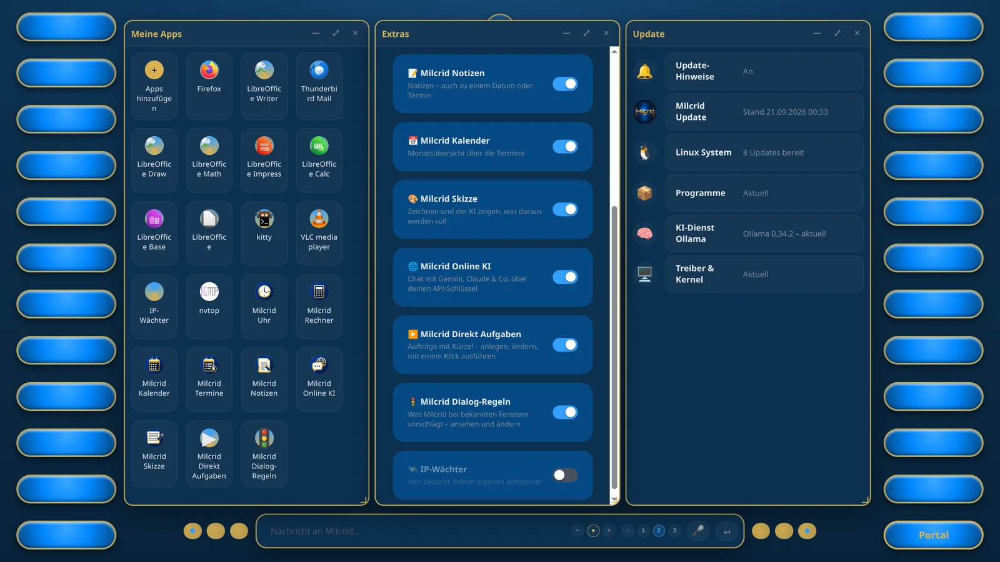

# Milcrid

**🇩🇪 [Deutsch](#deutsch) · 🇬🇧 [English](#english)**

<a id="deutsch"></a>

**Ein WebOS für lokale KI.**

> „KI braucht kein Ich. Sie braucht Dich für das Wir."
>
> Die nächste Stufe der digitalen Evolution ist keine reine Technologie – sie ist das perfekte Zusammenspiel aus
> deinem Verstand und digitaler Intelligenz.



Milcrid macht aus einem eigenen Rechner ein System, in dem eine lokale KI mitarbeitet: Sie öffnet auf Zuruf
Fenster und Programme, statt nur darüber zu reden – und sie läuft komplett auf deinem Rechner, ohne Cloud-Pflicht.

Gebaut von Klaus Döring zusammen mit KI als Mitentwickler – ohne Team, ohne Investoren.

---

## Was Milcrid kann

- **Läuft lokal** – keine Cloud nötig; eine Online-KI (z. B. Gemini) ist optional zuschaltbar
- **Die KI ist ins System eingebaut**, das Modell ist austauschbar (offene Modelle wie Qwen, Llama, Gemma)
- **Sprache:** Codewort („Computer, öffne die Uhr") oder Mikrofon-Knopf
- **Eigene Apps:** Uhr, Rechner, Kalender, Termine, Notizen, Editor, Bildbetrachter, Video, Skizze, Papierkorb, Handbuch
- **Datei Manager** mit USB-Sticks und externen Festplatten
- **Echte Fensterverwaltung:** verschieben, stapeln, nebeneinander, minimieren ins Icon-Fenster
- **Ehrliche KI:** Milcrid prüft, ob die KI getan hat, was sie behauptet – und sagt es, wenn nicht
- **Merkliste:** Befehle, die oft vorkommen, gehen sofort, ohne dass die KI nachdenken muss
- **System Test:** Milcrid prüft sich selbst (Prüfstand)
- **Handbuch** eingebaut, auf Deutsch und Englisch (oben im Handbuch umschalten)

| | |
|---|---|
|  |  |
|  |  |

Weitere Bilder: [bilder/](bilder/) · Galerie: [miluh.de](https://miluh.de/)

---

## ⚠️ Bitte zuerst lesen

**Milcrid ist ein Web-OS, keine App.** Es übernimmt den Start des Rechners, zeigt statt eines normalen Desktops
das Milcrid-Portal und darf Programme, Fenster, Lautstärke und Neustart steuern. Installiere es deshalb
**nur auf einem eigenen Rechner, der nur für Milcrid da ist** – nicht auf deinem Arbeits-PC.

Milcrid ist **in aktiver Entwicklung** und kein fertiges Produkt. Es läuft im täglichen Gebrauch, aber
es gibt keine Garantie. Wer Linux nicht kennt, wird es schwer haben.

## Voraussetzungen

- Eigener Rechner, **Ubuntu 24.04** (Server-Installation genügt)
- **NVIDIA-Grafikkarte, 16 GB empfohlen** (KI-Modell und Spracherkennung laufen gleichzeitig auf der Karte), Treiber eingerichtet
- Internet für die Installation (es werden rund 17 GB nachgeladen)
- Ein Mikrofon, wenn du mit Milcrid sprechen willst

## Installation

```bash
git clone https://github.com/kdshpger-png/Milcrid.git
cd Milcrid
bash milcrid-install.sh
```

Das Skript fragt einmal nach deinem Passwort (sudo) und dauert etwa eine halbe Stunde. Danach neu starten –
Milcrid startet von selbst.

**Was das Skript nachlädt** – nichts davon liegt in diesem Projekt, alles kommt aus den offiziellen Quellen:

| Was | Woher |
|---|---|
| Linux-Programme (Openbox, LibreOffice, Tonsystem …) | Ubuntu-Paketquellen |
| Firefox, Thunderbird | Snap |
| Ollama | ollama.com |
| KI-Modelle qwen3.5:9b und qwen3.5:4b (zusammen ~10 GB) | über Ollama |
| Spracherkennung (faster-whisper large-v3) | Hugging Face |
| Python-Bibliotheken | PyPI |
| Electron (das Fenster, in dem das Portal läuft) | npm |

Das Skript richtet außerdem ein: den automatischen Start von Milcrid, einige Befehle, die Milcrid ohne Passwort
ausführen darf (Neustart/Ausschalten, Paketverwaltung für Updates), und – falls Windows daneben liegt – das
Startmenü. Lies es gern vorher: [milcrid-install.sh](milcrid-install.sh).

## Lizenz

[PolyForm Noncommercial 1.0.0](LICENSE.md) – kurz gesagt:
**privat und nicht-kommerziell frei nutzbar. Gewerbliche Nutzung nur mit Erlaubnis** – frag gern nach.
(Maßgeblich ist der Lizenztext, nicht diese Zusammenfassung.)

## Kontakt

Homepage: [miluh.de](https://miluh.de/) · E-Mail: miluhevolution@freenet.de

Fehler und Fragen gern als *Issue* hier auf GitHub. Code-Beiträge (Pull Requests) nehmen wir derzeit nicht an.

---

*Team Miluh Evolution: Klaus – die Richtung · Gemini – die Weite · Claude Sonnet – das Bauen · Claude Opus – das
Nachdenken. Dieser Text wurde mit KI (Claude Opus) erstellt.*

---

<a id="english"></a>

# Milcrid – English

**A WebOS for local AI.**

> "KI braucht kein Ich. Sie braucht Dich für das Wir." – *AI doesn't need an "I". It needs you for the "we".*
>
> The next stage of digital evolution is not pure technology – it is the perfect interplay between your mind and
> digital intelligence.

> **Milcrid currently speaks German.** The whole interface is German, and the AI listens and answers in German.
> The **handbook is available in English** – inside Milcrid (switch **Deutsch · English** at the top of the handbook
> window) and here as [HANDBOOK_EN.md](HANDBOOK_EN.md), with a German–English word list.
> **An English version of Milcrid is in progress.**

Milcrid turns a computer of its own into a system in which a local AI works alongside you: on request it opens
windows and programs instead of just talking about them – and it runs entirely on your computer, no cloud required.

Built by Klaus Döring together with AI as co-developer – no team, no investors.

## What Milcrid can do

- **Runs locally** – no cloud needed; an online AI (e.g. Gemini) can optionally be switched on
- **The AI is built into the system**, the model is exchangeable (open models such as Qwen, Llama, Gemma)
- **Voice:** wake word ("Computer, öffne die Uhr" – *Computer, open the clock*) or microphone button
- **Own apps:** clock, calculator, calendar, appointments, notes, editor, image viewer, video, sketch, trash, handbook
- **File manager** including USB sticks and external drives
- **Real window management:** move, stack, side by side, minimize into the icon window
- **Honest AI:** Milcrid checks whether the AI really did what it claims – and says so if it didn't
- **Memory list:** frequent commands run instantly, without the AI having to think
- **System test:** Milcrid checks itself

## ⚠️ Please read first

**Milcrid is a web OS, not an app.** It takes over the computer's start, shows the Milcrid portal instead of a
normal desktop, and may control programs, windows, volume and restart. Install it **only on a computer of its own,
used just for Milcrid** – not on your work PC.

Milcrid is **under active development** and not a finished product. It runs in daily use, but there is no warranty.
Without Linux experience it will be hard.

## Requirements

- A computer of its own, **Ubuntu 24.04** (server installation is enough)
- **NVIDIA graphics card, 16 GB recommended** (AI model and speech recognition run on the card at the same time), driver installed
- Internet for the installation (about 17 GB are downloaded)
- A microphone if you want to talk to Milcrid

## Installation

```bash
git clone https://github.com/kdshpger-png/Milcrid.git
cd Milcrid
bash milcrid-install.sh
```

The script asks once for your password (sudo) and takes about half an hour. Then restart – Milcrid starts by itself.

**What the script downloads** – none of it is part of this project, everything comes from the official sources:

| What | From |
|---|---|
| Linux programs (Openbox, LibreOffice, sound system …) | Ubuntu package sources |
| Firefox, Thunderbird | Snap |
| Ollama | ollama.com |
| AI models qwen3.5:9b and qwen3.5:4b (about 10 GB together) | via Ollama |
| Speech recognition (faster-whisper large-v3) | Hugging Face |
| Python libraries | PyPI |
| Electron (the window the portal runs in) | npm |

The script also sets up: the automatic start of Milcrid, a few commands Milcrid may run without a password
(restart/shutdown, package management for updates) and – if Windows is on the same machine – the boot menu.
Feel free to read it first: [milcrid-install.sh](milcrid-install.sh).

## License

[PolyForm Noncommercial 1.0.0](LICENSE.md) – in short: **free for private, non-commercial use. Commercial use only
with permission** – just ask. (The license text is binding, not this summary.)

## Contact

Homepage: [miluh.de](https://miluh.de/) · E-mail: miluhevolution@freenet.de

Bug reports and questions are welcome as *issues* here on GitHub. We don't accept code contributions (pull requests) at the moment.

---

*Team Miluh Evolution: Klaus – direction · Gemini – breadth · Claude Sonnet – building · Claude Opus – reflection.
This text was written with AI (Claude Opus).*
